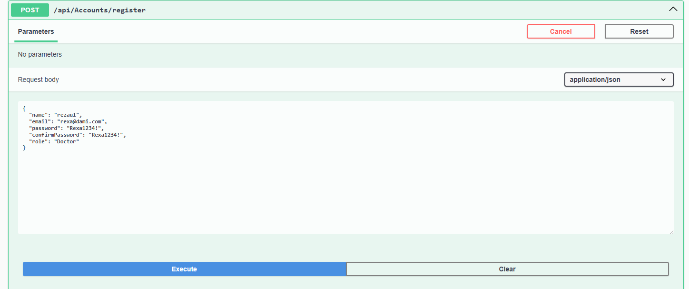
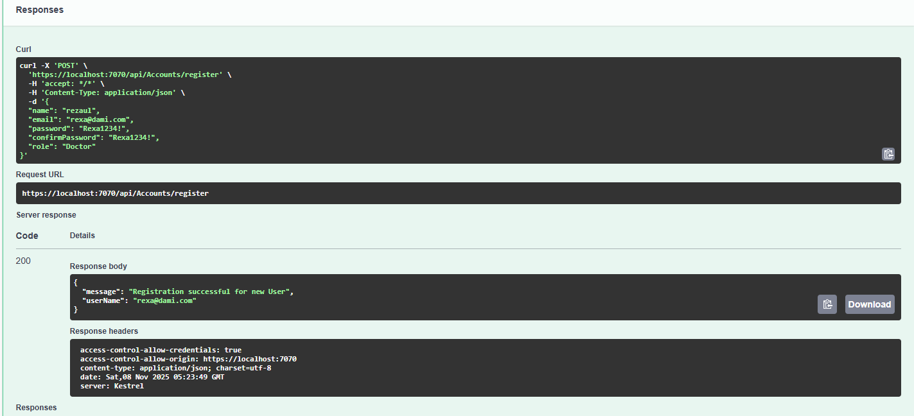
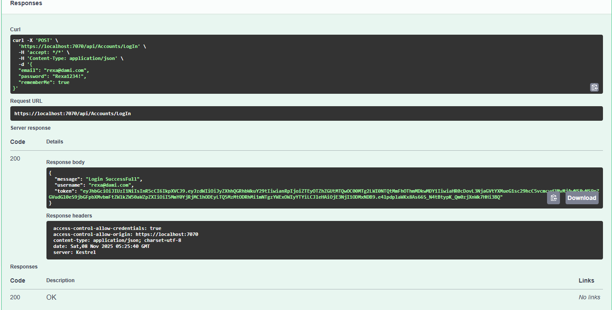

# JsonWebTokenWithIdentity #
```
🛡️ JSON Web Token (JWT) Authentication API

🔐 Overview

This project demonstrates user authentication and authorization using JSON Web Tokens (JWT) in an ASP.NET Core Web API.
It includes features for user registration, login, and JWT token generation for secure API access.

🚀 Features

✅ User Registration with password 

🔑 User Login with JWT generation

🔄 Token-based authentication & authorization

👥 Role-based access control

🧩 ASP.NET Identity integration

🧠 Middleware to protect secure endpoints

🧰 Technologies Used

ASP.NET Core 8

Entity Framework Core 

SQL Server (Database)

JWT (System.IdentityModel.Tokens.Jwt)

ASP.NET Identity

Swagger for API testing

🧑‍💻 Project Structure
JsonWebTokenWithIdentity/
│
├── Controllers/
│   ├── AccountController.cs      // Handles Login & Registration
│
├── Data/
│   ├── AppDbContext.cs        // Database context
├──DBIbitializer
│   ├── DbInitializer.cs
│   ├── IDbInitializer.cs 
├── Models/
|   ├──ViewModels
|   |  ├──LoginViewModel.cs
|   |  ├── RegisterViewModel.cs
│   ├── ApplicationUser.cs     // Identity User model
│   ├── Appointment.cs
├──  Extensions
|   |  ├──ApplicationServiceExtention.cs
├── Services/
│   ├── TokenService.cs        // Generates JWT token
│
├── Utility/
│   ├── Helper.cs

├── Program.cs
├── appsettings.json
└── README.md

⚙️ Configuration
1️⃣ Add Connection String

In your appsettings.json, configure your database connection:

ConnectionStrings": {
    "con": "server=(localdb)\\MSSQLLocalDB;Database=JsonTokenWithAuthenticationDb;Trusted_Connection=True;TrustServerCertificate=True;"}

}

2️⃣ Add JWT Secret Key in appsettings.Development.json
 "AppSettings": {
   "TokenKey": "a1b2c3d4e5f60123456789abcdef012389abcdef0123456789abcdef01234567MySecretkeyHereMySecretkeyHereMySecretkeyHereuseItforLoginsigning"
 }

🏗️ Setup Instructions
1️⃣ Clone the Repository
git clone https://github.com/your-username/JsonWebTokenWithIdentity.git
cd JsonWebTokenWithIdentity

2️⃣ Apply Database Migrations
dotnet ef database update

3️⃣ Run the Application
dotnet run

4️⃣ Test in Swagger or Scalar

Open in browser:

https://localhost:7070/swagger


or

https://localhost:7070/scalar

🔑 API Endpoints
Register User

POST /api/auth/register

{
  "userName": "sornali",
  "email": "sornali@example.com",
  "password": "Password@123"
}

Login User

POST /api/auth/login

{
  "email": "sornali@example.com",
  "password": "Password@123"
}


✅ Returns:

{
  "token": "eyJhbGciOiJIUzI1NiIsInR5cCI6..."
}

Protected Endpoint Example

GET /api/user/profile
➡️ Add Header:

Authorization: Bearer <your-token>

🔒 JWT Token Details

The generated JWT includes:

User ID

Username

Email

Roles (if used)

Expiration time

Example code for token generation:

var key = new SymmetricSecurityKey(Encoding.UTF8.GetBytes(_config["AppSettings:TokenKey"]));
var creds = new SigningCredentials(key, SecurityAlgorithms.HmacSha256);
var token = new JwtSecurityToken(
    claims: claims,
    expires: DateTime.Now.AddHours(1),
    signingCredentials: creds
);
return new JwtSecurityTokenHandler().WriteToken(token);

🧪 Testing with Swagger

Run the project → Open Swagger UI

Register a new user

Login → copy the returned token

Click Authorize button → paste token

Access protected endpoints ✅

📦 Dependencies
Microsoft.AspNetCore.Identity.EntityFrameworkCore
Microsoft.EntityFrameworkCore.SqlServer
Microsoft.EntityFrameworkCore.Tools
Microsoft.IdentityModel.Tokens
System.IdentityModel.Tokens.Jwt
Swashbuckle.AspNetCore 

## 🖥️ Application Screenshot
Registration:
```


```
Response:
```


```
Login:
```


```
Response:
```


```


📜 License

This project is licensed under the MIT License — feel free to use and modify it.
```
